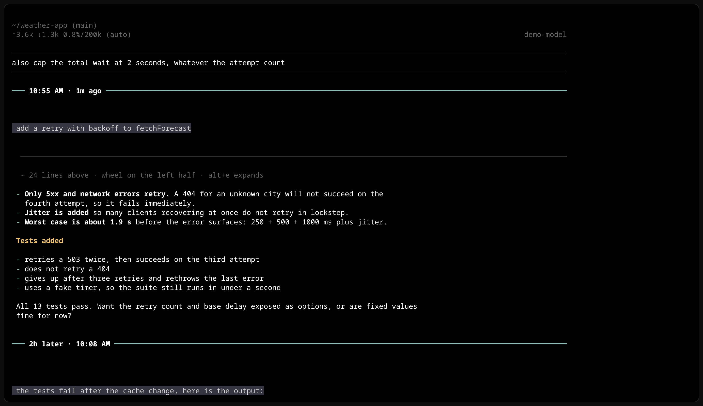
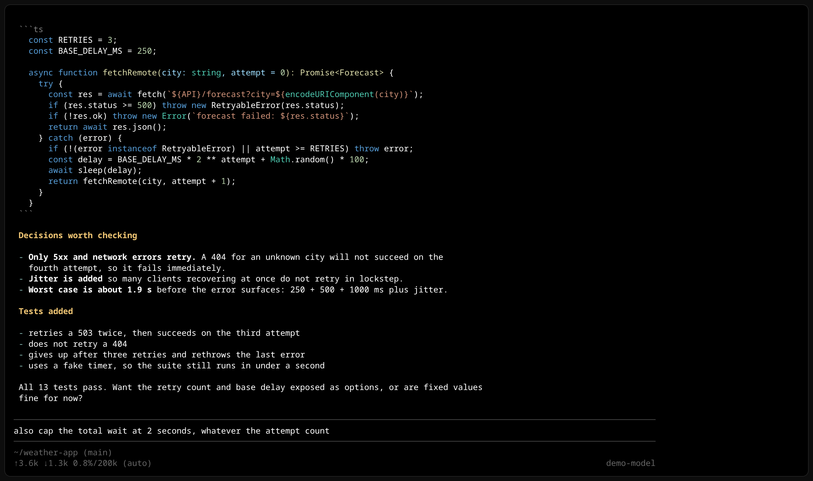
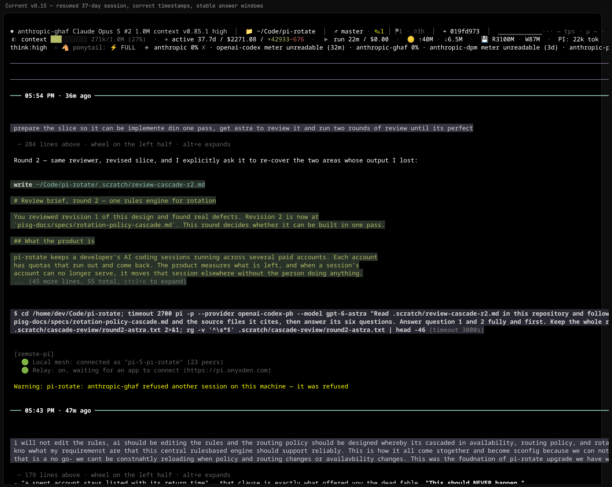

# pi-reverse

Reverse mode for the [pi coding agent](https://pi.dev): **input pinned to the top**, Q&A pairs
stacked **downward, newest first**, each pair still read normally — question, then its answer.

Named after Warp's *reverse mode*, which does the same for command blocks. This is the first one
for an agent conversation: VS Code refused the equivalent request for Copilot Chat (issue #12321,
closed out-of-scope, Dec 2025).

```text
  [ status bar ]
  [ input ]
  ▲ Q-BETA: list numbers 1 to 60          ← sticky question while its answer scrolls
  58
  59
  60
  ──────────────────────────────────────  ← rule between pairs
  Q-ALPHA: reply exactly: ALPHA-ANSWER
  ALPHA-ANSWER
```

It is a plain pi extension — no fork, no patched install, survives `pi update`.

---

## Why

### 1. Your eyes belong at the top of the screen

The prompt lives at the bottom of a terminal because that is where a shell leaves the cursor, not
because it is a good place to look. On a tall window you spend the day glancing down at the last
two rows, and the taller the terminal the worse the angle — which is also why people size their
terminal around the input instead of around the work.

pi-reverse pins the input near the top. You read straight ahead, the box never moves while a reply
streams, and the status bar sits with it.



### 2. In a long session, the question is gone

This is the part that actually hurts. A reply runs for 200 lines; by the time you are reading the
end of it, the question that produced it left the screen long ago. Scroll back and you lose your
place in the answer. Scroll forward and you lose the question again.

Below is a real session in stock pi: sixty lines into an answer, nothing on screen tells you what
was asked, and the input box is at the very bottom.



### 3. Question and answer stay one block

The same session in pi-reverse. Each turn is a unit: the question, then its answer capped at ~70%
of the pane with `⋯ 135 lines above` marking what is folded, then a rule, then the previous turn.
Two complete exchanges fit on one screen. Scroll inside an answer on the left half of the pane;
scroll through the stack on the right half. Nothing loses its question.



Old sessions open like this too — `pi --session <file>` on a months-old transcript and it is
suddenly scannable, pair by pair, without reading it bottom-up. The session file is never modified;
this is display only.

---


## Install

```bash
pi install ~/Code/pi-reverse          # adds it to settings
pi -e ~/Code/pi-reverse               # or load once, nothing written
```

Requires fullscreen TUI mode: `{"tuiMode": "fullscreen"}` in `~/.pi/agent/settings.json`, or
`pi --tui-mode fullscreen`. In regular mode pi renders into the terminal's own scrollback, which
can only grow at the bottom — no extension can pin a top row there, and pi-reverse declines with a
warning instead of half-applying.

## Moving around

| | |
|---|---|
| `alt+j` / `/reverse next` | top of the next (older) Q&A pair |
| `alt+k` / `/reverse prev` | top of the previous pair — mid-pair it returns to that pair's question first |
| `alt+l` / `/reverse tail` | end of the answer being written |
| `/reverse question` | back to the newest question |
| `alt+,` / `alt+.` | scroll inside the newest answer's window |
| `alt+e` / `/reverse expand` | show that answer at full height, or re-window it |
| `alt+w` / `/reverse window` | turn answer windows on or off |

## The seam between pairs carries a time

```text
━━━ 04:19 AM · 1h ago ━━━━━━━━━━━━━━━━━━━━━━━━━━━━━━━━━━━━━
```

Every pair is closed by a seam above **and** below it, so a turn reads as one block rather than as
text that happens to be next to other text. The rule is labelled with when the question below it was asked. A border inside an
answer never carries a time, so the seam can no longer be confused with one — and when a turn follows
a long pause the label says so instead (`4h later · 08:14`), which is how you find where you picked
the session back up. A turn whose time cannot be established reads `time unknown` rather than
guessing. The rule is drawn heavy and in the theme accent, the time in bright white, so the seam
outranks every border that appears *inside* an answer — `divider-style line` for the thin version.

Startup output (the banner, context and resource lists) is not a turn: it keeps its own order and
gets no rules between its pieces.

## Long answers get one screenful

**Every answer gets 70% of the pane**, so each pair is one readable block and the next one stays in
sight below it. Both heights are settings (`answer-lines` for all answers, `older-lines` to give
older pairs a shorter preview instead). Heights are measured from the terminal on every frame, so
splitting or resizing a tmux pane resizes the windows with it — down to a 5-line floor, below which
the transcript simply scrolls.

An answer longer than its height renders as a window anchored at its **end**, so the conclusion
sits next to the question instead of a screen-and-a-half below it. A dim marker says how much is
hidden. The window follows the text while it streams, and stops following the moment you scroll — in the
answer or in the transcript, in either direction. Nothing pulls you back while a reply is still
arriving; scroll back to where the stream is and following resumes, the way every chat client
behaves.

**Where the wheel goes is decided by the pointer**, like two panes side by side: on the **left half**
of the terminal it scrolls *inside* the answer, on the **right half** it scrolls the transcript. No
mode, no focus — move the mouse and you are in the other scroll. Reaching the end of an answer
**stops there**; the transcript does not grab the wheel mid-gesture (`wheel-chain on` restores it).
`wheel-zone right` swaps the sides, `full` gives the whole width to the answer, `off` leaves the
wheel to pi.

### The mouse wheel inside an answer needs a patched pi

Stock pi never forwards mouse events to anything drawn inside the transcript: its `ScrollView`
inherits `Container.handleMouse`, and alt-screen dispatch skips layout nodes that do. The keyboard
controls above work everywhere; the wheel-inside-an-answer does not, until that one-line seam exists.

The patch is 20 lines plus tests:

- Fork with the patch: **https://github.com/panbergco/pi** — branch `fix/scrollview-mouse-forwarding`
- The change, reviewable: **https://github.com/panbergco/pi/pull/1**
- Upstream report: **https://github.com/earendil-works/pi/issues/9538** (waiting on a maintainer
  `lgtm`; pi only accepts PRs from approved contributors)

To run it:

```bash
git clone -b fix/scrollview-mouse-forwarding https://github.com/panbergco/pi.git pi-fork
cd pi-fork && npm ci --ignore-scripts && npm run build
node packages/coding-agent/dist/bundle/cli.js --tui-mode fullscreen -e ~/Code/pi-reverse
```

Your own pi install, sessions and settings are untouched — it is a separate binary reading the same
agent directory.

## Settings

`/reverse` shows them all; every change applies immediately and persists to
`<agent-dir>/pi-reverse.json`.

| option | values | default | what it does |
|---|---|---|---|
| `dock` | `top` `bottom` | `top` | which screen edge the prompt block sits on |
| `order` | `newest-first` `oldest-first` | `newest-first` | transcript direction |
| `status-bar` | `above-prompt` `below-prompt` | `above-prompt` | status bar side |
| `spinner` | `below-prompt` `above-prompt` | `below-prompt` | where the working spinner and queued messages go |
| `answer-lines` | `70%`, `screen`, or `3..200` | `70%` | height of the newest answer |
| `older-lines` | `same` or `3..200` | `same` | height of answers in older pairs |
| `wheel-zone` | `left` `right` `full` `off` | `left` | which half of the pane scrolls inside an answer |
| `wheel-chain` | `on` `off` | `off` | pass the wheel to the transcript at an answer's end |
| `sticky-question` | `on` `off` | `on` | keep the question on screen once it scrolls away |
| `turn-divider` | `on` `off` | `on` | rule between Q&A pairs |
| `divider-time` | `on` `off` | `on` | stamp that rule with when the question was asked |
| `divider-style` | `line` `heavy` | `heavy` | weight of that rule |
| `follow-tail` | `on` `off` | `on` | chase a streaming answer instead of letting it grow past the fold |
| `tail-margin` | `0..5` | `1` | lines kept below the streaming line |
| `pad-outer` | `0..5` | `1` | blank lines at the screen edge |
| `pad-transient` | `0..5` | `1` | breathing room around the spinner |

`/reverse flip` swaps top/bottom, `/reverse reset` restores defaults.

## How it works

pi's fullscreen layout root is a `VStack [transcript, dock]` built from seven mounted regions
(document, pending, status, widgets-above, editor, widgets-below, footer). pi-reverse rebuilds that
root in the order you configure, and feeds the transcript a mirror container that groups the chat
log into turns — a turn starts at each user question — and reverses the **groups**, never their
contents.

## Performance

A long transcript is thousands of lines. Re-rendering all of it every frame is what made scrolling
crawl, so off-screen turns keep the lines they produced last time and are rendered again as soon as
they come near the viewport — nothing stale is ever on screen. Mouse hit-testing uses the layout
from the last render instead of re-rendering to find the target.

Measured on a 1,165-component session at 245x59, wheel-to-repaint: **25-28 ms** median with
pi-reverse, **45-73 ms** for stock pi on the same transcript.

## Known limits

- **Leans on pi internals** (the seven mounted regions, and `UserMessageComponent` as the marker for
  "a turn starts here"). If a pi release changes that shape, pi-reverse refuses to apply and prints
  a warning rather than breaking the UI.
- **Flipping resets the scroll position** — a fresh scroll view is built each time.
- The startup "Update Available" notice renders its three lines reversed; it arrives after the
  layout is applied, and pi adds it as separate children rather than one component.
- Verified against pi 0.84.2 and 0.85.1.

## Tests

```bash
node test.mjs      # layout order, turn grouping, jump targets, config validation
```

## Future ideas

Parked work, the research behind it, and who else has asked for this: [IDEAS.md](IDEAS.md).
